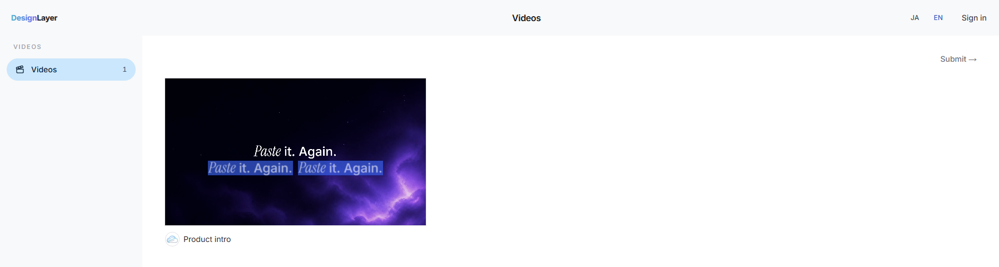

<p align="center">
  
</p>

<p align="center">
  <em>Send a launch video with a pull request.</em>
</p>

<p align="center">
  <a href="https://design-layer.com/en/videos/submit"></a>
  <a href="https://design-layer.com/en/videos"></a>
</p>

---

This repository accepts launch videos for the [DesignLayer catalog](https://design-layer.com/en/videos). A merged pull request is a candidate for the site. A closed pull request is a rejection.

The short way is the form. Sign in with GitHub at [Submit a video](https://design-layer.com/en/videos/submit), and the pull request is opened from your account. The steps below are the same submission, done by hand.

<p align="center">
  
</p>

## Folder

Add one folder directly under `submissions/` for each video.

```text
submissions/my-launch-video/
  video.mp4
  prompt.txt
  meta.json
  logo.png
```

The folder name is lowercase letters, numbers, and hyphens only (`my-launch-video`). A name that already exists cannot be reused.

| File | Required | Contents |
|---|---|---|
| `video.mp4` | Yes | MP4. 16:9, up to 60 seconds, up to 50MB. |
| `prompt.txt` | Yes | The instructions used to make the video. |
| `meta.json` | Yes | Title, description, and author name. X and website are optional. |
| `logo.png` | No | The author's logo, as a PNG. |

`meta.json`:

```json
{
  "title": "Video title",
  "description": "The text shown on the detail page",
  "authorName": "Author name",
  "x": "https://x.com/example",
  "website": "https://example.com"
}
```

`x` and `website` can be omitted. A link appears on the published video only when the field is filled in.

Do not include an email address. Published videos are announced on X.

## How to send it

1. Fork this repository.
2. Add the folder above.
3. Open a pull request.
4. Leave the rights sentence from the pull request template in the body:

   > この動画・プロンプト・ロゴの権利を自分が持っていることを確認しました。

   That line means: I confirm that I hold the rights to this video, prompt, and logo.

## After it is merged

The folder is copied into DesignLayer at `video-submissions/<name>/`, then removed from this public repository. Later edits and removals happen in that site folder.

On the catalog, submitted videos are listed after the official ones. The detail page shows the title, description, author name, and the logo when one was included.
